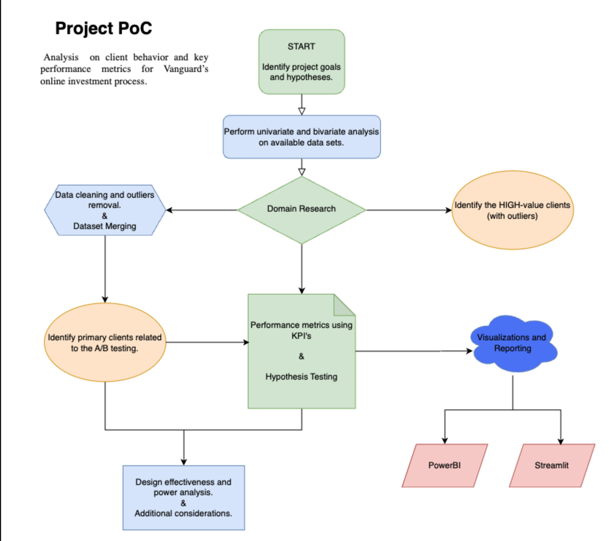

# Vanguard Investment Project

## Table of Contents
1. [Project Overview](#project-overview)
2. [Hypotheses](#hypotheses)
3. [Data Sources](#data-sources)
4. [Data Preparation and Cleaning](#data-preparation-and-cleaning)
5. [Exploratory Data Analysis (EDA)](#exploratory-data-analysis-eda)
6. [Visualizations](#visualizations)
7. [Design Effectiveness and Power Analysis](#design-effectiveness-and-power-analysis)
8. [Conclusion](#conclusion)
9. [Project Management and Presentation](#Project-Management-and-Presentation)
11. [Contact](#contact)

## Project Overview

- This project aims to analyze client behavior and key performance metrics for Vanguard's online investment process. The goal is to determine if the new user interface (UI) leads to a higher completion rate compared to the traditional UI through A/B testing.

## Hypotheses

### 1st Hypothesis: Completion Rate Analysis

- **Null Hypothesis (H0):** There is no significant difference in completion rates between the Test and Control groups.
- **Alternative Hypothesis (H1):** The completion rate is significantly higher in the Test group compared to the Control group.

### 2nd Hypothesis: Completion Rate with Cost-Effectiveness Threshold

- **Null Hypothesis (H0):** The increase in completion rate is less than 5%.
- **Alternative Hypothesis (H1):** The increase in completion rate is at least 5%.

### 3rd Hypothesis: Interaction Patterns

- **Null Hypothesis (H0):** There is no difference in the number of actions taken between the Test and Control groups.
- **Alternative Hypothesis (H1):** There is a significant difference in the number of actions taken between the Test and Control groups.

## Data Sources
1. `df_final_demo.csv`: Client demographic data.
2. `df_final_web_data_pt_1.csv`: Web interaction data for the first period.
3. `df_final_web_data_pt_2.csv`: Web interaction data for the second period.
4. `df_final_experiment_clients.csv`: Information on clients involved in the experiment.

## Data Preparation and Cleaning
1. **Loading Data:** Load and inspect datasets.
2. **Univariate and Bivariate Analysis:** Perform initial analysis to understand variables relation, and outlier detection.
3. **Cleaning Data:** Handle missing values, remove duplicates, and address outliers.
4. **Merging Datasets:** Merge datasets to create a comprehensive dataset for analysis.

## Exploratory Data Analysis (EDA)
1. **Demographic Analysis:** Analyze client demographics (age, gender, tenure, balance).
2. **Behavior Analysis:** Study client behavior based on web interaction data.
3. **High-Value Clients:** Identified primary clients based on the A/B testing, and before cleaning identified high value clients (with outliers).

## Visualizations

### 1. Proof of Concept (PoC) Diagram

- *High-level overview of the project methodology, from data collection to analysis and conclusions.*

### 2. Completion Rates (1st Hypothesis)

- *Comparison of completion rates between the Test and Control groups.*

### 3. Completion Rate with Cost-Effectiveness Threshold (2nd Hypothesis)

- *Completion rate based on a Cost-effectiveness treshold.*

### 4. Normalization Detection (3rd Hypothesis)

- *Histogram and Q-Qplot after removing outliers for better normalization. Shapiro-Wilk test of 0.94 and 0.95 (Normal Distribution)*

### 5. Interaction Pattern (3rd Hypothesis)

- *Bar plot showing average actions required to complete the process per group*

### 6. Duration Acessment

- *Line graph showing normalization after 4 months, showing that duration of the experiment was enough*

### 6. Power Analysis on Completion Rate

- *Power Analysis using Cohen's D effect to access if the sample size was enough*

### PowerBI and Streamlit

-

## Design Effectiveness and Power Analysis
1. **Duration Acessment:** As showed on the line graph, 4 months were indeed enough to reach normalization.
2. **Power Analysis on Completion Rate:** The required sample size per group was 3926, well inferior to our sample sizes, which means it was enough for the experiment.

- **Overall the A/B testing was well structured with an homogenous traits (gender, balance, age) on both samples, with enough sizes and time to obtain tangible results!**

## Conclusion

- The new user interface significantly improved the completion rate. The A/B test design was effective, and the sample size was sufficient to detect meaningful differences.

## Project Management and Presentation

- [Notion](https://fluttering-gram-d49.notion.site/Vanguard-Project-994f4e09dc754c6a88341fdc3e81e02a)
- [Presentation](https://docs.google.com/presentation/d/1LbIrWp5f5J0NiaSSlKvnwH0MVz_TNlPTeb-bqVBjFHs/edit?usp=sharing)

## Contact

- [Alexandre Linkedin](https://www.linkedin.com/in/alexandre-ribeiro-264445279/) 
- [José Linkedin](https://www.linkedin.com/in/jos%C3%A9-pedro-barbosa-brand%C3%A3o-663a172b6/)
