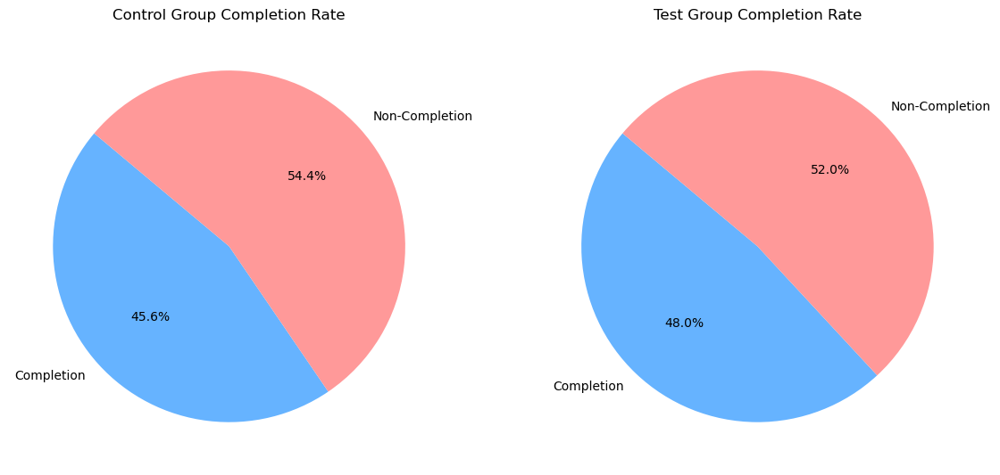

# Vanguard Investment Project

## Table of Contents
1. [Project Overview](#project-overview)
2. [Hypotheses](#hypotheses)
3. [Data Sources](#data-sources)
4. [Data Preparation and Cleaning](#data-preparation-and-cleaning)
5. [Exploratory Data Analysis (EDA)](#exploratory-data-analysis-eda)
6. [Hypothesis Testing](#hypothesis-testing)
7. [Design Effectiveness and Power Analysis](#design-effectiveness-and-power-analysis)
8. [Key Findings](#key-findings)
9. [Visualizations](#visualizations)
10. [Conclusion](#conclusion)
11. [How to Run the Project](#how-to-run-the-project)
12. [Contact](#contact)

## Project Overview

- This project aims to analyze client behavior and key performance metrics for Vanguard's online investment process. The goal is to determine if the new user interface (UI) leads to a higher completion rate compared to the traditional UI through A/B testing.

## Hypotheses

### 1st Hypothesis: Completion Rate Analysis

- **Null Hypothesis (H0):** There is no significant difference in completion rates between the Test and Control groups.
- **Alternative Hypothesis (H1):** The completion rate is significantly higher in the Test group compared to the Control group.

### 2nd Hypothesis: Completion Rate with Cost-Effectiveness Threshold

- **Null Hypothesis (H0):** The increase in completion rate is less than 5%.
- **Alternative Hypothesis (H1):** The increase in completion rate is at least 5%.

### 3rd Hypothesis: Interaction Patterns

•	**Null Hypothesis (H0):** There is no difference in the number of actions taken between the Test and Control groups.
•	**Alternative Hypothesis (H1):** There is a significant difference in the number of actions taken between the Test and Control groups.

## Data Sources
1. `df_final_demo.csv`: Client demographic data.
2. `df_final_web_data_pt_1.csv`: Web interaction data for the first period.
3. `df_final_web_data_pt_2.csv`: Web interaction data for the second period.
4. `df_final_experiment_clients.csv`: Information on clients involved in the experiment.

## Data Preparation and Cleaning
1. **Loading Data:** Load and inspect datasets.
2. **Univariate and Bivariate Analysis:** Perform initial analysis to understand the data.
3. **Cleaning Data:** Handle missing values, remove duplicates, and address outliers.
4. **Merging Datasets:** Merge datasets to create a comprehensive dataset for analysis.

## Exploratory Data Analysis (EDA)
1. **Demographic Analysis:** Analyze client demographics (age, gender, tenure, balance).
2. **Behavior Analysis:** Study client behavior based on web interaction data.
3. **High-Value Clients:** Identify high-value clients and their traits.

## Hypothesis Testing
1. **Completion Rate Calculation:** Calculate completion rates for both Test and Control groups.
2. **Statistical Testing:** Perform chi-square test to determine if the difference in completion rates is statistically significant.

## Design Effectiveness and Power Analysis
1. **Power Analysis:** Assess the sample size and effect size using Cohen's d.
2. **Design Evaluation:** Evaluate the effectiveness of the A/B test design and duration.

## Key Findings
1. **Completion Rate by Variation:**
   - Control: 45.6%
   - Test: 48.0%
2. **Chi-Square Test Results:**
   - Chi-Square Statistic: 188.3202
   - P-value: 0.0000
3. **Power Analysis Results:**
   - Effect Size (Cohen's d): 0.0632
   - Required sample size per group: 3926.69
   - Actual sample size (Test group): 176641
   - Actual sample size (Control group): 140482

## Visualizations

### 1. Proof of Concept (PoC) Diagram

*High-level overview of the project methodology, from data collection to analysis and conclusions.*

### 2. Completion Rates by Variation 

*Comparison of completion rates between the Test and Control groups.*

### 2. Cumulative Completion Rates Over Time

*Accumulation of completion rates over the duration of the experiment, showing stabilization over time.*

### 3. Gender Distribution by Group

*Gender distribution within the Test and Control groups.*

### 4. Age Distribution by Group

*Comparison of age distribution between the Test and Control groups.*

### 5. Balance Distribution by Group

*Comparison of balance distributions between the Test and Control groups.*

### 6. Proof of Concept (PoC) Diagram

*High-level overview of the project methodology, from data collection to analysis and conclusions.*

## Conclusion
The new user interface significantly improved the completion rate. The A/B test design was effective, and the sample size was sufficient to detect meaningful differences.

## How to Run the Project

### Prerequisites
- Python 3.x
- Conda

### Steps
1. Clone the repository:
   ```bash
   git clone https://github.com/your-repository/vanguard-investment-project.git
